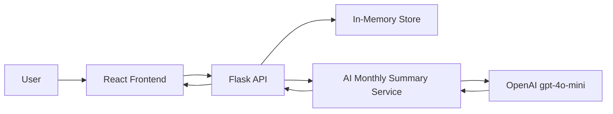

# expense-tracking-app

Full-stack starter workspace for a Flask + React expense tracking application.

## Demo
- Live demo link: [Add your deployed URL here](#)

## Architecture


## Project Structure
- `backend/`: Flask API for auth, transactions, categories, budgets, dashboard summary, and CSV export.
- `frontend/`: React (Vite) client for dashboard cards, transaction form, and recent transactions.
- `.github/copilot-instructions.md`: workspace-wide Copilot instructions.
- `.github/agents/`: custom agents for review, planning, and debugging workflows.
- `documents/`: requirements, planning, and AI project notes including `ai_spec.md`, `model_comparison.md`, `prompt_engineering.md`, `prompt_evaluation.md`, `rag_plan.md`, `responsible_ai.md`, and `technical_report.md`.

## Backend Setup (Flask)
```bash
cd backend
python -m venv .venv
.venv\Scripts\activate
pip install -r requirements.txt
python run.py
```

Backend runs on `http://localhost:5000`.

## Frontend Setup (React)
```bash
cd frontend
npm install
npm run dev
```

Frontend runs on `http://localhost:5173` and calls the backend via `http://localhost:5000/api`.

## Notes
- This scaffold uses an in-memory store in backend for fast MVP setup.
- Replace auth placeholder hashing and token logic with secure production implementations.
- Add persistence (PostgreSQL/MySQL/SQLite) and migrations before production release.

## Realtime (WebSocket) Support

This project includes optional realtime updates using Socket.IO so the dashboard reflects transactions and categories immediately across connected clients.

Backend setup notes:

- Socket.IO is integrated using `flask-socketio` and `eventlet`. Install backend deps with:

```bash
cd backend
.venv\Scripts\activate
pip install -r requirements.txt
```

Frontend setup notes:

- The frontend uses `socket.io-client`. Install dependencies and run the dev server:

```bash
cd frontend
npm install
npm run dev
```

Configuration:

- By default the frontend connects to `http://localhost:5000`. To override, set `VITE_SOCKET_IO_URL` in your environment before starting the frontend.

Security & production:

- In production, use a robust WSGI server and configure CORS and authentication for socket connections.
- Consider using a message broker (Redis) for scaling Socket.IO across multiple backend processes.

Supported currencies:

- The app supports multiple currency codes for display formatting: `USD`, `EUR`, `GBP`, `JPY`, `CAD`, `AUD`, and `PKR`.


