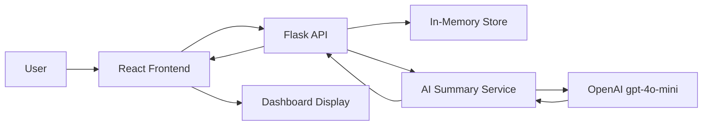

# Technical Report: Expense Tracking App with AI Monthly Summary

## Title Page
**Project Title:** Expense Tracking App with AI Monthly Spending Summary

**Student Names:** Shahzaib Sardar

**Student IDs:** SAP 55111

**Course / Section:** AI Driven Software Development

**Instructor:** Zia-ul-Murtaza

**Date:** 2026-06-21

---

## Abstract
This project is a full-stack expense tracking application built with a Flask backend and a React frontend. The core product allows users to register, log in, manage transactions, create categories, set monthly budgets, and export financial data to CSV. To satisfy the generative AI component of the assignment, the application also includes an AI monthly spending summary feature. The AI feature collects computed financial context from the backend, then generates a short natural-language review of monthly income, expenses, budget usage, and the user’s largest spending category. OpenAI `gpt-4o-mini` is used as the default model because it provides a strong balance of cost, latency, and summary quality for an interactive dashboard experience. The prompt is structured to return JSON so the frontend can render the result reliably. If the model cannot be called, the app falls back to a deterministic summary so the dashboard remains usable. 

## Problem Statement and Motivation
Many users track expenses in spreadsheets or basic apps, but they still need help understanding what their spending patterns mean. Raw totals are useful, but they do not immediately answer questions like: Where is most of the money going? Is the user staying within budget? What should the user do next? This project solves that problem by combining a standard expense tracker with an AI-generated monthly summary. The application helps users record financial activity and then turns those records into readable insight. The motivation for adding AI is not to replace accounting logic, but to present the existing data in a more helpful and human-friendly way.

## Architecture Diagram

### System Design Notes
- The React frontend handles login, dashboard display, and summary requests.
- The Flask backend exposes REST endpoints for auth, transactions, categories, budgets, dashboard summaries, and reports.
- The in-memory store keeps the MVP simple and fast for development.
- The AI summary service builds structured monthly context and passes it to the LLM.
- The frontend renders both normal finance metrics and the AI-generated summary.

## LLM and Model Selection with Justification
The monthly spending summary uses OpenAI `gpt-4o-mini` by default. This choice was made after comparing it with larger OpenAI models, Claude, Gemini, and open-source alternatives.

### Comparison Summary
- `gpt-4o` / `gpt-4.1`: stronger reasoning and writing quality, but higher cost and latency.
- `gpt-4o-mini`: lower cost, faster response, and good enough quality for short monthly summaries.
- Claude: strong writing and safety, but a different vendor workflow.
- Gemini: useful for large context, but not necessary for this short financial summary task.
- Open-source models: good for self-hosting, but require more infrastructure and setup.

### Justification
The project does not need a large model for deep reasoning because the backend already computes the totals, categories, and budget usage. The model’s main job is to convert structured data into a clear natural-language summary and a few recommendations. `gpt-4o-mini` is therefore the best fit because it is fast, inexpensive, and suitable for interactive dashboard use. The model can also be changed through the `OPENAI_MODEL` environment variable if future testing shows another model performs better.

## Prompt Engineering Section with Examples and Iterations
The prompt was designed to behave like a careful personal finance assistant. It uses a role instruction, a negative instruction, and a strict JSON output format.

### Prompt Design Principles
- Role prompt: ask the model to act as a finance assistant.
- Negative prompt: explicitly say not to invent numbers or transactions.
- Structured output: require JSON keys such as `summary`, `recommendations`, and `flags`.
- Context limit: only use the supplied monthly JSON context.

### Example Prompt Evolution
#### v1: Basic zero-shot
"Summarize this month’s spending and give recommendations."

#### v2: Structured output
"Return valid JSON with `summary`, `recommendations`, and `flags`."

#### v3: Context-heavy and grounded
"Use only the JSON context, do not invent data, and focus on monthly cash flow, budget usage, and the largest spending category."

### Current Implementation
The current prompt is stored in [backend/prompts/monthly_spending_summary.txt](../backend/prompts/monthly_spending_summary.txt). It tells the model to:
- stay concise,
- avoid invented numbers,
- return valid JSON,
- and focus on monthly spending, budget status, and recommendations.

### Iteration Notes
The current prompt is a structured prompt rather than a conversational chat prompt. This makes the dashboard easier to implement because the frontend can parse the result consistently. Future improvement could add a short example output block and a few more prompt variants for comparison.

## RAG Pipeline Design (If Applicable)
For this project, a full RAG pipeline was not included in the MVP because the application already stores the relevant monthly financial data in a structured backend format and the AI task only requires a short monthly summary. In this use case, retrieval over a vector store would add extra infrastructure, embedding costs, indexing logic, and additional evaluation work without improving the core demo enough to justify the added complexity.

### Proposed RAG Pipeline
1. Chunk monthly transactions and budget records into short text records.
2. Generate embeddings for those records.
3. Store the embeddings in a vector database such as Chroma or FAISS.
4. Retrieve the top matching records for the requested month or question.
5. Inject the retrieved records into the prompt.
6. Generate the final AI summary with stronger grounding.

### Why RAG Would Help
- It would reduce hallucinations.
- It would make the output easier to trust.
- It would allow source-based answers and future chat-style features.

### Current Status
The current implementation uses computed backend context directly because the dataset is already small, clean, and fully available at generation time. That design keeps the MVP faster, simpler, and easier to test while still producing grounded summaries. RAG remains a strong future enhancement if the project grows into a chat assistant or needs citations from larger document collections.

## Agent Design and Tool Descriptions (If Applicable)
No autonomous multi-step agent loop is currently implemented. The current AI feature is a single-step summarization pipeline rather than a tool-using agent. The system does, however, use several internal functions that act like tools in the summary workflow.

### Tool-Like Components in the Current Design
- Monthly context builder: collects income, expenses, top category, and budget data.
- Prompt loader: reads the prompt template from a file.
- LLM caller: sends the structured request to OpenAI.
- Fallback generator: produces a deterministic summary if the model call fails.

### Why No Full Agent Was Used
The assignment’s first AI feature only needs a short monthly summary. A full planner/reasoner/tool loop would add complexity without improving the core demo significantly. If the project is extended later, an agent could be added for question answering over monthly data.

## Evaluation Results with Metrics and Tables
The current project has both implementation validation and a separate evaluation plan.

### Validation Results
| Metric | Result | Notes |
|---|---:|---|
| Backend AI summary unit tests | 2 / 2 passed | Validates context building and fallback summary behavior |
| Frontend production build | Passed | Confirms dashboard UI and AI summary components compile |
| Fallback behavior without API key | Working | The app returns a deterministic summary when the key is missing |

### Planned Prompt Evaluation Metrics
| Metric | Target |
|---|---|
| Accuracy | Summary numbers must match backend totals |
| Groundedness | No invented transactions, budgets, or categories |
| Relevance | Output should stay focused on spending and budgets |
| Brevity | Summary should fit in a dashboard card |
| Actionability | At least 2 to 3 useful recommendations |

### Suggested Test Set Coverage
The evaluation plan includes at least 20 diverse monthly cases such as no transactions, overspent budgets, under-budget months, high-income months, travel-heavy months, and months with sparse notes.

## Responsible AI and Limitations Section
The AI summary feature is intentionally limited so it stays useful and safe.

### Responsible AI Practices
- The model receives computed financial context instead of raw conversational text.
- The prompt explicitly says not to invent data.
- The app falls back to a deterministic summary if the API key is unavailable.
- API keys are stored in environment variables rather than source code.
- The UI should label the result as AI-generated.

### Limitations
- The current feature does not use RAG citations yet.
- The app is still using an in-memory store, so it is not production-grade persistence.
- The model can still hallucinate if prompt constraints are weakened.
- The feature is designed for summaries, not for tax, legal, or accounting advice.

## Conclusion and Future Enhancements
This project demonstrates a practical way to combine a standard expense tracker with a useful generative AI feature. The base application handles transaction tracking, categorization, budgeting, dashboard summaries, and CSV export. The AI layer adds a monthly spending summary that helps the user understand the data more quickly. Future improvements should focus on adding a real database, improving security, introducing RAG for stronger grounding, expanding prompt evaluation, and optionally adding a chat-style assistant for querying financial history.

## References
1. Flask Documentation. Available: https://flask.palletsprojects.com/
2. React Documentation. Available: https://react.dev/
3. Vite Documentation. Available: https://vite.dev/
4. OpenAI API Documentation. Available: https://platform.openai.com/docs/
5. Flask-SocketIO Documentation. Available: https://flask-socketio.readthedocs.io/
